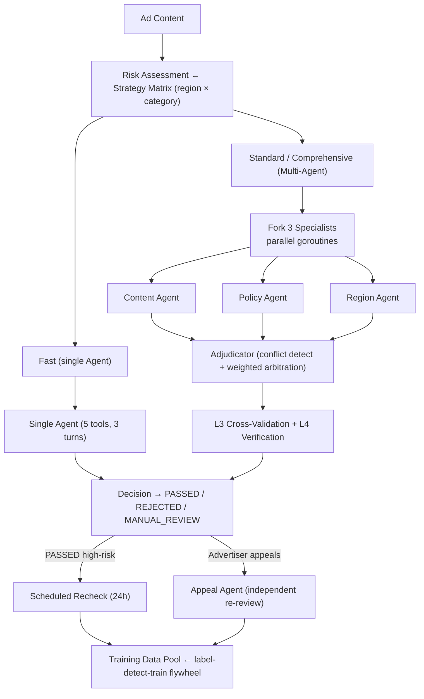

# AdGuard Agent

[](README.md) [](README_zh.md)

Multi-Agent content safety system for cross-border advertising review.

## Overview

AdGuard Agent automates ad content review across global markets, covering the full lifecycle from ad submission through post-approval monitoring to advertiser appeal. The system addresses three core challenges of cross-border advertising:

- **Multi-region compliance divergence** — The same ad may be legal in one market and prohibited in another. Healthcare, finance, alcohol, and gambling regulations vary dramatically across regions. A data-driven strategy matrix (zero hardcoded rules) encodes all region × category routing.
- **Adversarial landing pages** — Landing pages (50–200KB HTML) are the highest-frequency rejection reason and can be swapped post-approval to evade review. The system performs landing page analysis with size-budget control and schedules post-approval rechecks for high-risk ads.
- **False-positive cost** — Mistakenly rejecting a compliant ad directly translates to advertiser revenue loss and platform GMV impact. A 4-layer false-positive control pipeline (historical consistency → confidence threshold → multi-agent cross-validation → independent verification) minimizes incorrect rejections while maintaining fail-closed safety.

## Business Pipeline

The system implements a **Perception → Attribution → Adjudication → Governance** pipeline covering ad review end-to-end:

### Perception

Ad content ingestion and signal extraction. ContentAnalyzer parses ad text and creative metadata. LandingPageChecker fetches and analyzes landing page HTML with a 2-layer size budget (per-tool 32KB + per-round 200KB) and smart HTML signal extraction (title, meta, privacy policy detection). HistoryLookup retrieves the advertiser's prior review records and reputation score.

### Attribution

Risk assessment via the strategy matrix engine. Each (region × category) pair maps to: applicable policies, risk level, and review pipeline tier. Covers 20 policies across 6 regions and 23 risk categories. All routing is data-driven — adding a new policy or region requires only a data file change, not a code change.

### Adjudication

Three pipeline tiers route ads by risk:

| Tier | Agents | Scope |
|------|--------|-------|
| **Fast** | Single agent, 5 tools, 3 turns | Low-risk ads |
| **Standard** | 3 specialists (Content / Policy / Region) in parallel → Adjudicator | Medium-risk |
| **Comprehensive** | Multi-agent + L3 cross-validation + L4 verification | High-risk, regulated categories |

Specialists run in parallel via goroutines, each with isolated state and filtered tool sets. The Adjudicator synthesizes results with conflict detection and weighted arbitration. Fail-closed: any unresolvable uncertainty escalates to MANUAL_REVIEW.

### Governance

Post-decision lifecycle management, closing the loop from review to strategy improvement:

- **Scheduled post-approval recheck** — High-risk PASSED ads are re-reviewed after a configurable delay (default 24h). Defends against adversarial landing page swaps. JSONL-persisted task queue with crash recovery; missed tasks execute on restart, expired tasks (>72h) auto-discard.
- **Appeal workflow** — Advertiser submits appeal → independent re-review by Appeal Agent (reuses same agentic loop) → UPHELD / OVERTURNED / PARTIAL. One appeal per ad. OVERTURNED decisions feed training data.
- **Training data flywheel** — Three-source collection: high-confidence reviews, verification overrides, and appeal overturns. Filterable by source / region / category. Completes the label-detect-train closed loop.
- **Advertiser reputation** — Trust score linked to appeal outcomes. OVERTURNED raises trust; UPHELD lowers trust and increments violations. Risk tiers: trusted / standard / flagged / probation.
- **Strategy A/B testing** — Canary vs active version metrics comparison (pass rate, avg confidence, false positive count). Auto-recommendation: ROLLBACK if canary FP rate > 2× active, PROMOTE if metrics equal or better, CONTINUE if inconclusive.

## False-Positive Control

False positives — mistakenly rejecting compliant ads — are the central tension in ad review. Each false rejection means advertiser revenue loss, platform GMV impact, and potential advertiser churn. The system implements 4 layers of defense:

| Layer | Mechanism | When |
|-------|-----------|------|
| **L1** | **Historical consistency** — HistoryLookup checks the advertiser's past decisions and similar cases. High-reputation advertisers get consistency-weighted leniency on boundary cases. | Every review |
| **L2** | **Confidence threshold** — REJECTED decisions below the pipeline's confidence threshold (default 0.7) are downgraded to MANUAL_REVIEW. `AllowAutoReject` flag can disable auto-rejection entirely. | Every rejection |
| **L3** | **Multi-Agent cross-validation** — Unanimous agreement boosts confidence (+0.05). 2:1 split follows majority with 15% confidence penalty; PASSED majority with REJECTED minority escalates to MANUAL_REVIEW. 3-way disagreement forces MANUAL_REVIEW (confidence capped at 0.5). Critical violations override any PASSED decision. | Standard / Comprehensive |
| **L4** | **Verification (LLM-as-Judge)** — Independent re-check of REJECTED decisions. The verifier sees only ad content and violations, not the original agent's reasoning. Fail-closed: any disagreement or error → MANUAL_REVIEW. Overrides feed training data pool. | Risk-triggered |

Design principle: every layer can only escalate toward human review (MANUAL_REVIEW), never away from it. The system errs on the side of caution — letting a borderline ad through to human review is always preferable to an automated false rejection.

## Architecture



## Implemented Components

### Review Pipeline

- **Strategy Matrix** — (region × category) → policies, risk level, pipeline tier. 20 policies, 6 regions, 23 categories. Zero hardcoded rules.
- **Agentic Loop** — State machine (PENDING → ANALYZING → JUDGING → DECIDED) with transition audit, max_output_tokens recovery, fail-closed fallback.
- **Tool System** — 5 review tools with fail-closed defaults, concurrent execution for read-only tools, input validation, result truncation.
- **Multi-Agent Orchestrator** — 3 specialists in parallel (goroutines) + Adjudicator with conflict detection and weighted arbitration.
- **Review Engine** — Full orchestration: strategy matrix → pipeline selection → agentic loop → structured ReviewResult.

### Reliability & Efficiency

- **Model Routing** — pipeline × role 2-level routing matrix. xAI 3-tier hierarchy: `fast` (non-reasoning) / `standard` (balanced) / `comprehensive` (strongest reasoning). Cross-provider fallback chain.
- **529 Overload Fallback** — 3 consecutive 529s trigger automatic degradation via fallback chain.
- **Streaming Tool Execution** — Go channel + goroutine dispatches tools during LLM streaming. JSON fragment concatenation O(n) instead of incremental parsing O(n²). Auto non-streaming fallback.
- **Tool Result Budget** — 2-layer: per-tool 32KB + per-round 200KB. Disk fallback with 2KB smart preview (HTML signal extraction).
- **Context Management** — 3-layer cascading compression (Micro → Auto → Reactive) with circuit breaker and diminishing returns detection. Supports 15+ ads in batch.
- **Graceful Shutdown** — SIGINT/SIGTERM handler + cleanup registry + 5s failsafe. Waits for in-flight reviews, then flushes all JSONL stores.
- **JSONL Persistence** — Append-only, crash-safe. Per-store files. Startup recovery via log replay; corrupted lines silently skipped.

### Governance & Feedback Loop

- **Verification** — Independent LLM-as-Judge for REJECTED decisions. Fail-closed: disagree → MANUAL_REVIEW only. Overrides feed training pool.
- **Appeal Workflow** — Full lifecycle (SUBMITTED → REVIEWING → RESOLVED). Appeal Agent reuses Run(). OVERTURNED → training data.
- **Scheduled Recheck** — Background scheduler for high-risk PASSED ads (default 24h). JSONL task queue with crash recovery.
- **Strategy A/B Testing** — Canary vs active metrics. Auto-recommend: ROLLBACK / PROMOTE / CONTINUE.
- **Training Data Pool** — 3-source collection (reviews, overrides, appeals). Filterable by source / region / category.
- **Advertiser Reputation** — Trust score linked to appeal outcomes. Tiers: trusted / standard / flagged / probation.
- **ReviewStore** — Structured storage with multi-dimensional queries (by ad, advertiser, region, decision). Data foundation for the training flywheel.

### Infrastructure

- **LLM Client** — OpenAI-compatible, multi-provider, exponential backoff, per-model usage tracking.
- **Hook System** — PreTool / PostTool / Stop hooks. Implementations: permission control, audit trail, circuit breaker, result validation, final audit.
- **Query Chain Tracking** — ChainID + Depth across parent/child agents for full execution graph reconstruction.
- **Strategy Version Management** — State machine (DRAFT → CANARY → ACTIVE → ROLLBACK). Hash-based deterministic traffic routing. Single-active + single-canary invariant.

## Quick Start

```bash
# Build
go build ./...

# Run all tests
go test ./... -v

# Run without API key (mock mode — reviews all 15 samples)
go run ./cmd/adguard/

# Run with API key (real LLM — Multi-Agent review with grok models)
LLM_API_KEY=your_key go run ./cmd/adguard/
```

## Real LLM Output

Three ads reviewed end-to-end with Multi-Agent orchestration (xAI grok models). Total cost: **$0.003**.

```
╔══════════════════════════════════════════════════════╗
║  AdGuard Agent — Ad Content Safety Review System     ║
║  16K lines Go  |  7 upgrades  |  Multi-Agent         ║
╚══════════════════════════════════════════════════════╝
=== Model Routing ===
  fast                   → grok-4-1-fast-non-reasoning
  standard               → grok-4-1-fast-reasoning
  comprehensive          → grok-4.20-0309-reasoning
  adjudicator            → grok-4.20-0309-reasoning
  appeal                 → grok-4.20-0309-reasoning
  fallback chain: grok-4.20-0309-reasoning → grok-4-1-fast-reasoning → gpt-4o

=== Review: 3 ads ===

--- ad_001 (US/healthcare) [multi-agent] ---
  ├─ region:        analyzing...
  ├─ content:       analyzing...
  ├─ policy:        analyzing...
  ├─ policy:        REJECTED        conf=1.00  (15.902s)
  ├─ region:        REJECTED        conf=1.00  (17.304s)
  ├─ content:       REJECTED        conf=1.00  (22.661s)
  ├─ adjudicator:   synthesizing...
  ├─ adjudicator:   REJECTED        conf=1.00  (7.812s)
  Verification: confirmed
  → REJECTED  conf=1.00  30.474s  (expected: REJECTED)

--- ad_002 (US/finance) [multi-agent] ---
  ├─ region:        analyzing...
  ├─ content:       analyzing...
  ├─ policy:        analyzing...
  ├─ region:        PASSED          conf=1.00  (10.389s)
  ├─ policy:        PASSED          conf=1.00  (17.473s)
  ├─ content:       PASSED          conf=1.00  (17.999s)
  ├─ adjudicator:   synthesizing...
  ├─ adjudicator:   PASSED          conf=1.00  (2.519s)
  Recheck: 24h scheduled (high-risk PASSED)
  → PASSED  conf=1.00  20.519s  (expected: PASSED)

--- ad_003 (EU/healthcare) [multi-agent] ---
  ├─ region:        analyzing...
  ├─ policy:        analyzing...
  ├─ content:       analyzing...
  ├─ policy:        MANUAL_REVIEW   conf=0.70  (25.941s)
  ├─ region:        MANUAL_REVIEW   conf=0.65  (26.05s)
  ├─ content:       MANUAL_REVIEW   conf=0.80  (33.057s)
  ├─ adjudicator:   synthesizing...
  ├─ adjudicator:   MANUAL_REVIEW   conf=0.85  (6.014s)
  → MANUAL_REVIEW  conf=0.90  39.072s  (expected: PASSED)

  Version: v1.0 active, v2.0 canary (10%)

=== Feature Showcase ===
  ✓ Graceful Shutdown     SIGINT/SIGTERM → wait in-flight → flush JSONL → 5s failsafe
  ✓ JSONL Persistence     78 reviews persisted (crash-safe, append-only)
  ✓ Model Routing         per-pipeline×role routing + 529 cross-provider fallback
  ✓ Tool Result Budget    2-layer: per-tool 32KB + per-round 200KB, disk fallback
  ✓ Streaming Executor    tools dispatch during LLM stream (channel+goroutine)
  ✓ Strategy A/B          v1.0 vs v2.0 → CONTINUE
  ✓ Scheduled Recheck     1 pending, 0 completed

  Total Cost: $0.0028
```

**Key observations:**
- **ad_001**: 3:0 unanimous REJECTED with confidence=1.0. Verification confirmed. Textbook violation (unverified medical claim + false FDA approval). 3 specialists run in parallel via goroutines (policy finishes first at 15.9s, content last at 22.7s), then adjudicator synthesizes.
- **ad_002**: 3:0 unanimous PASSED with confidence=1.0. Scheduled for 24h post-approval recheck (high-risk finance category) — defends against adversarial landing page swap.
- **ad_003**: 3:0 MANUAL_REVIEW — EU strict healthcare region causes all three specialists to flag for human review (region conf=0.65, policy conf=0.70, content conf=0.80). Adjudicator aggregates to conf=0.85. This is the fail-closed design working correctly: when uncertain, escalate rather than auto-approve.
- **Feature Showcase**: JSONL persistence count (78) accumulates across runs, demonstrating crash-safe append-only durability. A/B recommendation is CONTINUE (insufficient canary data for conclusive comparison).

## Configuration

Environment variables (highest priority):

| Variable | Default | Description |
|----------|---------|-------------|
| `LLM_PROVIDER` | `xai` | LLM provider name |
| `LLM_BASE_URL` | `https://api.x.ai/v1` | API endpoint |
| `LLM_MODEL` | `grok-4-1-fast-reasoning` | Model identifier |
| `LLM_API_KEY` | — | API key (required for real LLM mode) |
| `LOG_LEVEL` | `warn` | Log level (debug/info/warn/error) |
| `DATA_DIR` | `data` | Path to data directory |

Model routing is configured via `RoutingConfig` in code (see `internal/llm/router.go:DefaultRoutingConfig`).

Config file (`config.json` in project root, optional) and built-in defaults provide fallback values.

## Project Structure

```
cmd/adguard/         CLI entry point (dual mode: real LLM / mock LLM)
internal/
  types/             Shared types (messages, review, strategy)
  llm/               LLM client, retry, usage tracking, model router
  config/            Configuration loading (env > file > defaults)
  shutdown/          Graceful shutdown with cleanup registry
  strategy/          Strategy matrix engine + version management + A/B testing
  agent/             Agentic loop, state machine, recovery, stream events
  agent/mock/        Mock LLM client and tool executor (for testing)
  tool/              Tool system: 5 review tools + executor + registry
  compact/           Context compression + token budget
  store/             ReviewStore + Verification + Appeal + Training pool + JSONL persistence
  recheck/           Scheduled post-approval recheck scheduler
data/
  policy_kb.json     Policy knowledge base (20 platform-aligned advertising policies)
  region_rules.json  Regional compliance rules (6 regions)
  category_risk.json Category -> risk level mapping (23 categories)
  samples/           Test ad samples (15 samples)
```
