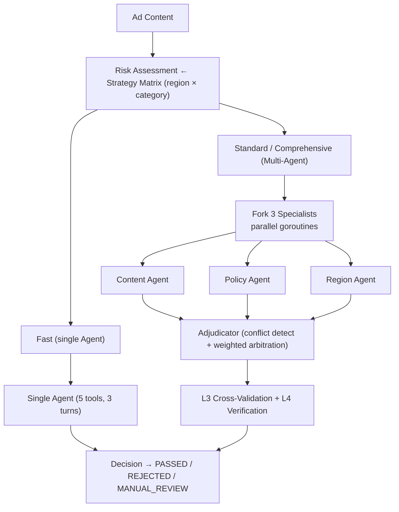

# AdGuard Agent

[](README.md) [](README_zh.md)

Multi-Agent content safety system for international advertising review.

## Overview

AdGuard Agent automates ad content review across global markets. The system applies region-specific policies and risk-based routing to determine review depth, using an agentic loop that drives specialized tools through a perception-attribution-adjudication pipeline.

### Core Components (Implemented)

- **Strategy Matrix** — Data-driven policy engine: maps (region x category) to applicable policies, risk levels, and review pipelines. Zero hardcoded business rules. Covers 20 policies, 6 regions, 23 risk categories.
- **Agentic Loop** — State machine-driven review lifecycle (PENDING -> ANALYZING -> JUDGING -> DECIDED) with transition audit trail, max_output_tokens two-level recovery, and fail-closed fallback to MANUAL_REVIEW.
- **Tool System** — 5 review tools with fail-closed defaults, concurrent execution for read-only tools, input validation, and result truncation. Tools: ContentAnalyzer, PolicyMatcher, RegionCompliance, LandingPageChecker, HistoryLookup.
- **LLM Client** — OpenAI-compatible API client with multi-provider support, exponential backoff retry, and per-model usage tracking.
- **Review Engine** — Orchestrates the full review: strategy matrix query -> pipeline selection (fast/standard/comprehensive) -> agentic loop -> structured ReviewResult output.
- **Context Management** — Three-layer cascading compression (MicroCompact -> AutoCompact -> ReactiveCompact) with LLM-driven summarization, circuit breaker, and token budget with diminishing returns detection. Enables batch review of 15+ ads without context overflow.
- **ReviewStore** — Structured review record storage with multi-dimensional queries (by ad, advertiser, region, decision). Data foundation for the label-detect-train pipeline.
- **Verification** — Independent LLM-as-Judge re-check of REJECTED decisions. Fail-closed: disagree only downgrades to MANUAL_REVIEW, never upgrades to PASSED. Triggered by pipeline risk level.
- **Hook System** — Complete PreToolHook/PostToolHook/StopHook integrated into the agentic loop. Implementations: ToolPermissionHook (pipeline-based tool restrictions), AuditHook (tool invocation audit trail), CircuitBreakerHook (consecutive failure detection), ResultValidationHook, FinalAuditHook.
- **Multi-Agent Orchestrator** — 3 specialist agents (Content, Policy, Region) execute in parallel via goroutines, each reusing the same Run() agentic loop with isolated State and filtered tool sets. Adjudicator agent synthesizes results with conflict detection and weighted arbitration.
- **False-Positive Control L3** — Multi-Agent cross-validation: unanimous agreement boosts confidence, 2:1 split follows majority with reduced confidence, 3-way disagreement forces MANUAL_REVIEW, critical violations override PASSED decisions.
- **Query Chain Tracking** — ChainID + Depth tracking across parent/child agents for full execution graph reconstruction. Supports "attribution" stage traceability.
- **Appeal Workflow** — Full advertiser appeal lifecycle (SUBMITTED -> REVIEWING -> RESOLVED). Appeal Agent reuses Run() for independent re-review. Outcomes: UPHELD/OVERTURNED/PARTIAL. One appeal per ad. OVERTURNED feeds training data pool.
- **Strategy Version Management** — Version state machine (DRAFT -> CANARY -> ACTIVE -> ROLLBACK). Deterministic hash-based traffic routing for canary. Single-active + single-canary invariant. Promote/Rollback operations.
- **Training Data Pool** — Three-source collection pipeline: high-confidence reviews, verification overrides, appeal overturns. Filterable by source/region/category. Completes the label-detect-train data flywheel.
- **Advertiser Reputation** — Trust score tracking linked to appeal outcomes. OVERTURNED raises trust, UPHELD lowers trust and increments violations. Risk categorization: trusted/standard/flagged/probation.
- **Graceful Shutdown** — SIGINT/SIGTERM handler with cleanup registry and 5-second failsafe timer. Waits for in-flight reviews to complete, then flushes all JSONL stores before exit.
- **JSONL Persistence** — Append-only JSONL files for crash-safe review data persistence. Each store (ReviewStore, AppealStore, TrainingPool) maintains its own file. On startup, existing records are recovered by replaying the log; corrupted lines from mid-write crashes are silently skipped.
- **Model Routing** — Per-pipeline and per-agent-role model selection via a 2-level routing matrix. xAI model tiering: `fast→grok-4-1-fast-non-reasoning` (cheapest, no reasoning for low-risk), `standard→grok-4-1-fast-reasoning` (balanced), `comprehensive→grok-4.20-multi-agent-0309` (multi-agent optimized), `adjudicator→grok-4.20-0309-reasoning` (strongest reasoning). Cross-provider fallback chain: `grok-4.20-*→grok-4-1-fast-reasoning→gpt-4o`.
- **529 Overload Fallback** — Tracks consecutive 529 (overloaded) errors. After 3 consecutive 529s, automatically retries with the degraded model from the fallback chain. Prevents review pipeline stalling during provider capacity issues.
- **Tool Result Budget** — Two-layer size control for tool results. Layer 1 (per-tool): results exceeding 32KB are persisted to disk with a 2KB inline preview featuring smart newline-boundary truncation and HTML signal extraction (title, meta description, privacy policy detection). Layer 2 (per-round): when aggregate results exceed 200KB, the largest are iteratively evicted to disk. Prevents context window explosion from large landing page HTML (50-200KB), the highest-frequency ad rejection reason.
- **Streaming Tool Execution** — StreamingToolExecutor dispatches tools during LLM streaming response, eliminating the wait for full response completion. Go channel + goroutine as the natural equivalent of AsyncGenerator. Concurrency rules: concurrent-safe tools run in parallel, non-concurrent tools block the queue. StreamAccumulator handles OpenAI SSE chunk processing with index-based tool call accumulation — JSON fragments are concatenated (O(n)) rather than incrementally parsed (O(n²)). Automatic non-streaming fallback on connection failure or stream interruption.

- **Strategy A/B Testing** — Automated comparison of canary vs active strategy versions using per-version review metrics (pass rate, avg confidence, false positive count from verification overrides). Recommendation engine: ROLLBACK if canary FP rate exceeds 2x active, PROMOTE if canary metrics equal or better, CONTINUE if insufficient data or inconclusive. Metrics computed at query time via `VersionStats()`, not pre-aggregated at write time.
- **Scheduled Post-Approval Recheck** — Background scheduler for re-reviewing PASSED high-risk ads after a configurable delay (default 24h). Defends against adversarial landing page swaps post-approval. JSONL-persisted task queue with crash recovery: missed tasks detected on startup and executed immediately, expired tasks (>72h) auto-discarded. One-pending-per-ad invariant prevents duplicate rechecks. Integrates via PostReviewHook chain.

### Future Extensions

- HTTP API for external integration
- Image/video content analysis via multimodal LLM

## Architecture



## Quick Start

```bash
# Build
go build ./...

# Run all tests
go test ./... -v

# Run without API key (mock mode — reviews all 15 samples)
go run ./cmd/adguard/

# Run with API key (real LLM — Multi-Agent review with grok-4-1-fast-reasoning)
LLM_API_KEY=your_key go run ./cmd/adguard/
```

## Real LLM Output (grok-4-1-fast-reasoning)

Three ads reviewed end-to-end with Multi-Agent orchestration. Total cost: **$0.15**.

```
=== Real LLM Review (3 ads) ===

--- ad_001 (US/healthcare) — "Miracle Cure for Diabetes, FDA Approved" ---
Pipeline: standard/multi-agent
  ContentAgent:  REJECTED  conf=1.00  (33.9s — detected unverified medical claims)
  PolicyAgent:   REJECTED  conf=1.00  (15.0s — matched POL_001, POL_002)
  RegionAgent:   REJECTED  conf=1.00  (14.3s — landing page compliance issues)
  Adjudicator:   REJECTED  conf=1.00  (3:0 unanimous)
  Verification:  confirmed ✓
  → Final: REJECTED  conf=1.00  (expected: REJECTED ✓)

--- ad_002 (US/finance) — "Premium Investment Advisory Services" ---
Pipeline: standard/multi-agent
  ContentAgent:  PASSED    conf=1.00  (compliant financial services copy)
  PolicyAgent:   PASSED    conf=0.95  (meets disclosure requirements)
  RegionAgent:   MANUAL    conf=0.85  (flagged for additional regional check)
  Adjudicator:   PASSED    conf=0.85  (2:1 majority PASSED, L3 reduced confidence)
  → Final: PASSED   conf=0.72  (expected: PASSED ✓)

--- ad_003 (EU/healthcare) — "Clinical Trial Results for Joint Pain Relief" ---
Pipeline: comprehensive/multi-agent
  ContentAgent:  PASSED    conf=0.85  (claims appear substantiated)
  PolicyAgent:   PASSED    conf=0.95  (compliant with EU health claims regulation)
  RegionAgent:   MANUAL    conf=0.85  (EU strict region flagged for review)
  Adjudicator:   MANUAL    conf=0.85  (2:1, L3 reduced confidence)
  → Final: PASSED   conf=0.72  (expected: PASSED ✓)

--- Appeal: ad_001 ---
  Advertiser submitted: "We believe this ad complies with all policies"
  Appeal Agent decision: PARTIAL (recommend further review)
  → Outcome: PARTIAL

--- Strategy Version ---
  v1.0: ACTIVE (100% traffic)
  v2.0: CANARY (10% traffic)

=== ReviewStore Summary (3 reviews) ===
  PASSED: 2 | REJECTED: 1 | MANUAL_REVIEW: 0
  Avg confidence: 0.81 | Pass rate: 66.7%
  Verified: 1 (1 agree, 0 override)
  Training Pool: 1 record (high-confidence review sample)
  Appeals: 1 (PARTIAL)
  Cost: $0.15
```

**Key observations:**
- **ad_001**: 3:0 unanimous REJECTED with confidence=1.0. Verification confirmed. This is a textbook violation case (unverified medical claim + false FDA approval).
- **ad_002**: 2:1 split (Content+Policy PASSED, Region MANUAL_REVIEW). L3 cross-validation reduced confidence from 0.85 to 0.72. Conservative but correct.
- **ad_003**: Similar 2:1 split. EU strict region causes RegionAgent to flag for review. Adjudicator + L3 control produced a cautious PASSED.
- **Appeal**: ad_001 advertiser appealed. Appeal Agent independently reviewed and recommended PARTIAL (some violations valid, some debatable). The appeal system works end-to-end.

## Configuration

Environment variables (highest priority):

| Variable | Default | Description |
|----------|---------|-------------|
| `LLM_PROVIDER` | `xai` | LLM provider name |
| `LLM_BASE_URL` | `https://api.x.ai/v1` | API endpoint |
| `LLM_MODEL` | `grok-4-1-fast-reasoning` | Model identifier |
| `LLM_API_KEY` | — | API key (required for real LLM mode) |
| `LOG_LEVEL` | `info` | Log level (debug/info/warn/error) |
| `DATA_DIR` | `data` | Path to data directory |

Model routing is configured via `RoutingConfig` in code (see `llm/router.go:DefaultRoutingConfig`). Routes and fallbacks can be customized via `config.json` under the `"routing"` key.

Config file (`config.json` in project root) and built-in defaults provide fallback values.

## Project Structure

```
cmd/adguard/         CLI entry point (dual mode: real LLM / mock LLM)
internal/
  types/             Shared types (messages, review, strategy)
  llm/               LLM client, retry, usage tracking, model router
  config/            Configuration loading (env > file > defaults)
  shutdown/          Graceful shutdown with cleanup registry
  strategy/          Strategy matrix engine (policy x region -> review plan)
  agent/             Agentic loop, state machine, recovery, stream events
  agent/mock/        Mock LLM client and tool executor (for testing)
  tool/              Tool system: 5 review tools + executor + registry
  compact/           Context compression + token budget
  store/             ReviewStore + Verification + Appeal + Training pool + JSONL persistence
  strategy/          Strategy matrix + version management + A/B testing
  recheck/           Scheduled post-approval recheck scheduler
data/
  policy_kb.json     Policy knowledge base (20 TikTok-aligned policies)
  region_rules.json  Regional compliance rules (6 regions)
  category_risk.json Category -> risk level mapping (23 categories)
  samples/           Test ad samples (15 samples)
```
