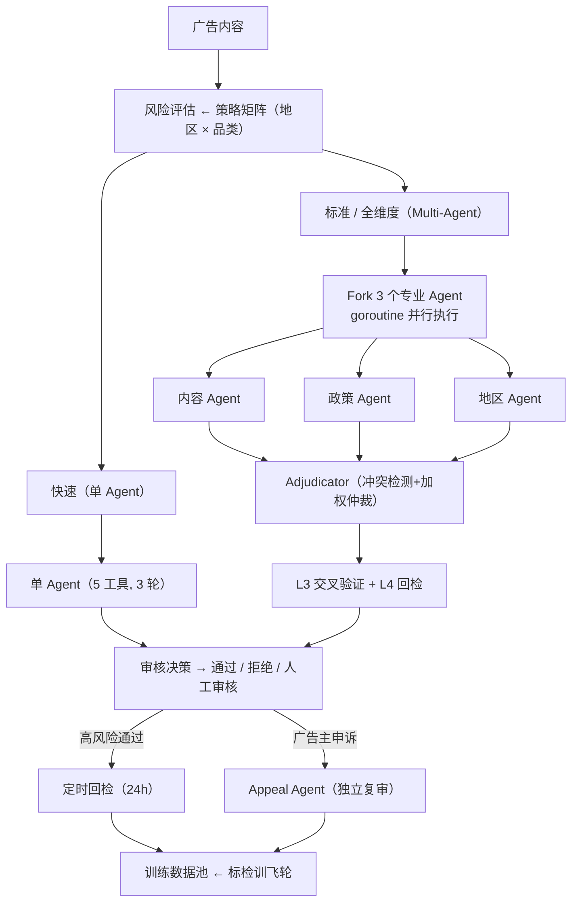

# AdGuard Agent

[](README.md) [](README_zh.md)

面向跨境广告审核的 Multi-Agent 内容安全系统。

## 概述

AdGuard Agent 自动化全球市场的广告内容审核，覆盖从广告提交、审核决策到投放后监控、广告主申诉的完整生命周期。系统应对跨境广告的三个核心挑战：

- **多地区合规差异** — 同一条广告在 A 市场合规，在 B 市场可能违规。医疗、金融、酒类、博彩等品类的监管规则因地区而异。数据驱动的策略矩阵（零硬编码规则）编码所有 地区 × 品类 路由逻辑。
- **对抗性落地页** — 落地页（50–200KB HTML）是广告审核最高频拒绝原因，且可在通过审核后被替换以规避检测。系统对落地页执行带大小预算控制的内容分析，并对高风险已通过广告调度投放后回检。
- **误伤成本** — 误拒合规广告直接导致广告主收入损失和平台 GMV 下降。4 层误伤控制流水线（历史一致性→置信度阈值→多 Agent 交叉验证→独立回检）在维持 fail-closed 安全性的同时最小化误拒。

## 业务流水线

系统实现 **感知（Perception）→ 归因（Attribution）→ 研判（Adjudication）→ 治理（Governance）** 四阶段流水线，端到端覆盖广告审核：

### 感知（Perception）

广告内容接入与信号提取。ContentAnalyzer 解析广告文本和素材元信息。LandingPageChecker 抓取并分析落地页 HTML，2 层大小预算（单工具 32KB + 单轮 200KB）+ 智能 HTML 信号提取（title、meta、隐私政策检测）。HistoryLookup 检索广告主历史审核记录和信誉评分。

### 归因（Attribution）

通过策略矩阵引擎进行风险定级。每个（地区 × 品类）对映射到：适用政策、风险等级、审核管线层级。覆盖 20 条政策、6 个地区、23 个风险品类。全部路由数据驱动——新增政策或地区只需修改数据文件，无需改代码。

### 研判（Adjudication）

三档管线按风险分级路由：

| 档位 | Agent 配置 | 适用场景 |
|------|-----------|---------|
| **快速** | 单 Agent，5 工具，3 轮 | 低风险广告 |
| **标准** | 3 专业 Agent（内容/政策/地区）并行 → Adjudicator | 中风险 |
| **全维度** | Multi-Agent + L3 交叉验证 + L4 回检 | 高风险、受监管品类 |

专业 Agent 通过 goroutine 并行执行，各自拥有独立 State 和过滤后的工具集。Adjudicator 汇总结果，冲突检测 + 加权仲裁。Fail-closed：任何无法解决的不确定性都升级为 MANUAL_REVIEW。

### 治理（Governance）

审核后生命周期管理，从审核决策闭环到策略改进：

- **投放后定时回检** — 高风险 PASSED 广告在配置延迟（默认 24h）后重新审核。防御广告主审核通过后替换落地页的对抗行为。JSONL 持久化任务队列 + crash 恢复；启动时补执 missed task，过期任务（>72h）自动丢弃。
- **申诉工作流** — 广告主提交申诉 → Appeal Agent 独立复审（复用同一个 Agentic Loop）→ UPHELD / OVERTURNED / PARTIAL。每条广告最多一次申诉。OVERTURNED 结果回流训练数据。
- **训练数据飞轮** — 三来源采集：高置信度审核、Verification override、申诉推翻。按 source/region/category 可筛选。完成标检训闭环。
- **广告主信誉** — 信任评分与申诉结果联动。OVERTURNED 提升信任；UPHELD 降低信任并累计违规。风险分类：trusted / standard / flagged / probation。
- **策略 A/B 测试** — Canary vs Active 版本指标对比（通过率、平均置信度、误伤次数）。自动推荐：canary 误伤率超 2 倍→ROLLBACK，指标持平或更优→PROMOTE，不确定→CONTINUE。

## 误伤控制

误伤——误拒合规广告——是广告审核的核心矛盾。每次误拒意味着广告主收入损失、平台 GMV 下降、广告主流失风险。系统实现 4 层防线：

| 层级 | 机制 | 触发时机 |
|------|------|---------|
| **L1** | **历史一致性** — HistoryLookup 检查广告主历史决策和相似案例。高信誉广告主在边界案例上获得一致性加权宽容。 | 每次审核 |
| **L2** | **置信度阈值** — REJECTED 决策低于管线置信度阈值（默认 0.7）时降级为 MANUAL_REVIEW。`AllowAutoReject` 标志可完全禁用自动拒绝。 | 每次拒绝 |
| **L3** | **Multi-Agent 交叉验证** — 全票一致提升置信度（+0.05）。2:1 分歧按多数但置信度降 15%；多数 PASSED 但少数 REJECTED 则升级为 MANUAL_REVIEW。三方分歧强制 MANUAL_REVIEW（置信度封顶 0.5）。Critical 违规覆盖任何 PASSED 决策。 | 标准/全维度管线 |
| **L4** | **Verification（LLM-as-Judge）** — 独立复核 REJECTED 决策。Verifier 仅能看到广告内容和违规项，看不到原 Agent 的推理过程。Fail-closed：任何 disagree 或错误 → MANUAL_REVIEW。Override 结果回流训练数据。 | 风险触发 |

设计原则：每一层只能向人工审核（MANUAL_REVIEW）方向升级，不能反向。系统宁可让边界广告进入人工审核，也不执行自动误拒。

## 架构



## 已实现组件

### 审核管线

- **策略矩阵** — （地区 × 品类）→ 政策、风险等级、管线层级。20 条政策、6 个地区、23 个品类。零硬编码规则。
- **Agentic Loop** — 状态机（PENDING → ANALYZING → JUDGING → DECIDED），含状态转换审计、max_output_tokens 恢复、fail-closed 降级。
- **工具系统** — 5 个审核工具，fail-closed 默认值，只读工具并发执行，输入校验，结果截断。
- **Multi-Agent 编排引擎** — 3 专业 Agent 通过 goroutine 并行 + Adjudicator 冲突检测和加权仲裁。
- **审核引擎** — 完整编排：策略矩阵 → 管线选择 → Agentic Loop → 结构化 ReviewResult。

### 可靠性与效率

- **模型路由** — pipeline × role 2 级路由矩阵。xAI 3 档分层：`fast`（无推理）/ `standard`（平衡）/ `comprehensive`（最强推理）。跨 Provider 降级链。
- **529 过载降级** — 3 次连续 529 自动使用降级链备选模型。
- **流式工具执行** — Go channel + goroutine 在 LLM 流式响应中调度工具。JSON 碎片拼接 O(n) 而非增量解析 O(n²)。连接失败自动降级非流式。
- **工具结果预算** — 2 层：单工具 32KB + 单轮 200KB。磁盘降级 + 2KB 智能预览（HTML 信号提取）。
- **Context 管理** — 3 层级联压缩（Micro → Auto → Reactive），熔断机制 + 边际递减检测。支持 15+ 条广告批量审核。
- **优雅退出** — SIGINT/SIGTERM 信号处理 + 清理函数注册表 + 5 秒 failsafe。等待 in-flight 审核完成后刷盘所有 JSONL。
- **JSONL 持久化** — 追加写入，crash-safe。每个 Store 独立文件。启动时日志重放恢复；残行静默跳过。

### 治理与反馈闭环

- **Verification 回检** — 独立 LLM-as-Judge 复核 REJECTED 决策。Fail-closed：disagree → MANUAL_REVIEW。Override 回流训练数据。
- **申诉工作流** — 全生命周期（SUBMITTED → REVIEWING → RESOLVED）。Appeal Agent 复用 Run()。OVERTURNED → 训练数据。
- **投放后定时回检** — 高风险 PASSED 广告后台调度（默认 24h）。JSONL 任务队列 + crash 恢复。
- **策略 A/B 测试** — Canary vs Active 指标对比。自动推荐：ROLLBACK / PROMOTE / CONTINUE。
- **训练数据池** — 三来源采集（审核、override、申诉）。按 source/region/category 可筛选。
- **广告主信誉** — 信任评分与申诉结果联动。分类：trusted / standard / flagged / probation。
- **ReviewStore** — 结构化存储，多维查询（按广告/广告主/地区/决策）。训练飞轮的数据基础。

### 基础设施

- **LLM Client** — OpenAI 兼容，多 Provider，指数退避重试，按模型用量追踪。
- **Hook 系统** — PreTool / PostTool / Stop Hook。实现：权限控制、审计日志、熔断、结果校验、终审审计。
- **Query Chain Tracking** — ChainID + Depth 追踪跨父子 Agent 的完整执行链路。
- **策略版本管理** — 状态机（DRAFT → CANARY → ACTIVE → ROLLBACK）。基于 hash 的确定性流量路由。单 ACTIVE + 单 CANARY 不变量。

## 快速开始

```bash
# 构建
go build ./...

# 运行全部测试
go test ./... -v

# 无 API key 运行（Mock 模式 — 审核全部 15 条样本）
go run ./cmd/adguard/

# 有 API key 运行（真实 LLM — Multi-Agent 审核）
LLM_API_KEY=your_key go run ./cmd/adguard/
```

## 真实 LLM 输出

3 条广告端到端 Multi-Agent 审核（xAI grok 模型），总 cost：**$0.003**。

```
╔══════════════════════════════════════════════════════╗
║  AdGuard Agent — Ad Content Safety Review System     ║
║  16K lines Go  |  7 upgrades  |  Multi-Agent         ║
╚══════════════════════════════════════════════════════╝
=== Model Routing ===
  fast                   → grok-4-1-fast-non-reasoning
  standard               → grok-4-1-fast-reasoning
  comprehensive          → grok-4.20-0309-reasoning
  adjudicator            → grok-4.20-0309-reasoning
  appeal                 → grok-4.20-0309-reasoning
  fallback chain: grok-4.20-0309-reasoning → grok-4-1-fast-reasoning → gpt-4o

=== Review: 3 ads ===

--- ad_001 (US/healthcare) [multi-agent] ---
  ├─ region:        analyzing...
  ├─ content:       analyzing...
  ├─ policy:        analyzing...
  ├─ policy:        REJECTED        conf=1.00  (15.902s)
  ├─ region:        REJECTED        conf=1.00  (17.304s)
  ├─ content:       REJECTED        conf=1.00  (22.661s)
  ├─ adjudicator:   synthesizing...
  ├─ adjudicator:   REJECTED        conf=1.00  (7.812s)
  Verification: confirmed
  → REJECTED  conf=1.00  30.474s  (expected: REJECTED)

--- ad_002 (US/finance) [multi-agent] ---
  ├─ region:        analyzing...
  ├─ content:       analyzing...
  ├─ policy:        analyzing...
  ├─ region:        PASSED          conf=1.00  (10.389s)
  ├─ policy:        PASSED          conf=1.00  (17.473s)
  ├─ content:       PASSED          conf=1.00  (17.999s)
  ├─ adjudicator:   synthesizing...
  ├─ adjudicator:   PASSED          conf=1.00  (2.519s)
  Recheck: 24h scheduled (high-risk PASSED)
  → PASSED  conf=1.00  20.519s  (expected: PASSED)

--- ad_003 (EU/healthcare) [multi-agent] ---
  ├─ region:        analyzing...
  ├─ policy:        analyzing...
  ├─ content:       analyzing...
  ├─ policy:        MANUAL_REVIEW   conf=0.70  (25.941s)
  ├─ region:        MANUAL_REVIEW   conf=0.65  (26.05s)
  ├─ content:       MANUAL_REVIEW   conf=0.80  (33.057s)
  ├─ adjudicator:   synthesizing...
  ├─ adjudicator:   MANUAL_REVIEW   conf=0.85  (6.014s)
  → MANUAL_REVIEW  conf=0.90  39.072s  (expected: PASSED)

  Version: v1.0 active, v2.0 canary (10%)

=== Feature Showcase ===
  ✓ Graceful Shutdown     SIGINT/SIGTERM → wait in-flight → flush JSONL → 5s failsafe
  ✓ JSONL Persistence     78 reviews persisted (crash-safe, append-only)
  ✓ Model Routing         per-pipeline×role routing + 529 cross-provider fallback
  ✓ Tool Result Budget    2-layer: per-tool 32KB + per-round 200KB, disk fallback
  ✓ Streaming Executor    tools dispatch during LLM stream (channel+goroutine)
  ✓ Strategy A/B          v1.0 vs v2.0 → CONTINUE
  ✓ Scheduled Recheck     1 pending, 0 completed

  Total Cost: $0.0028
```

**关键观察：**
- **ad_001**：3:0 全票 REJECTED，置信度=1.0。Verification 确认。典型违规（虚假医疗声明 + 伪造 FDA 批准）。3 个专业 Agent 通过 goroutine 并行（policy 15.9s 最先完成，content 22.7s 最后），adjudicator 汇总。
- **ad_002**：3:0 全票 PASSED，置信度=1.0。调度 24h 投放后回检（高风险金融品类）——防御审核通过后的对抗性落地页替换。
- **ad_003**：3:0 MANUAL_REVIEW —— EU 严格医疗地区导致三个专业 Agent 全部标记需人工审核（region conf=0.65, policy conf=0.70, content conf=0.80）。Adjudicator 聚合至 conf=0.85。这是 fail-closed 设计在正确工作：不确定时升级，而非自动放行。
- **Feature Showcase**：JSONL 持久化计数（78）跨运行累积，验证 crash-safe 追加写入的持久性。A/B 推荐为 CONTINUE（canary 数据不足以做出确定性对比）。

## 配置

环境变量（最高优先级）：

| 变量 | 默认值 | 说明 |
|------|--------|------|
| `LLM_PROVIDER` | `xai` | LLM 供应商 |
| `LLM_BASE_URL` | `https://api.x.ai/v1` | API 端点 |
| `LLM_MODEL` | `grok-4-1-fast-reasoning` | 模型标识 |
| `LLM_API_KEY` | — | API 密钥（真实 LLM 模式必需） |
| `LOG_LEVEL` | `warn` | 日志级别（debug/info/warn/error） |
| `DATA_DIR` | `data` | 数据目录路径 |

模型路由通过代码中的 `RoutingConfig` 配置（见 `internal/llm/router.go:DefaultRoutingConfig`）。

配置文件（项目根目录 `config.json`，可选）和内置默认值作为兜底。

## 项目结构

```
cmd/adguard/         CLI 入口（双模式：真实 LLM / Mock LLM）
internal/
  types/             共享类型（消息、审核、策略）
  llm/               LLM 客户端、重试、用量追踪、模型路由器
  config/            配置加载（env > file > defaults）
  shutdown/          优雅退出 + 清理函数注册表
  strategy/          策略矩阵引擎（策略 × 地区 → 审核方案）
  agent/             Agentic Loop、状态机、恢复机制、流事件
  agent/mock/        Mock LLM 客户端和工具执行器（测试用）
  tool/              工具系统：5 个审核工具 + 执行器 + 注册表
  compact/           Context 压缩 + Token 预算
  store/             ReviewStore + Verification + 申诉 + 训练数据池 + JSONL 持久化
  strategy/          策略矩阵 + 版本管理 + A/B 测试
  recheck/           投放后定时回检调度器
data/
  policy_kb.json     政策知识库（20 条平台对齐广告政策）
  region_rules.json  地区合规规则（6 个地区）
  category_risk.json 品类 → 风险等级映射（23 个品类）
  samples/           测试广告样本（15 条）
```

## 路线图

- HTTP API 对外集成
- 图片/视频内容分析（多模态 LLM）
