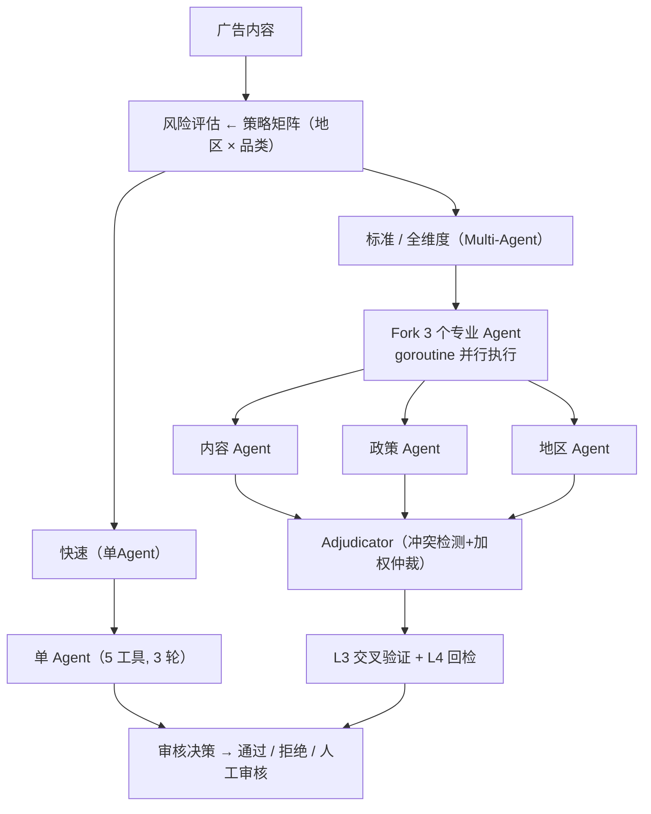

# AdGuard Agent

[](README.md) [](README_zh.md)

面向国际化广告审核的 Multi-Agent 内容安全系统。

## 概述

AdGuard Agent 自动化全球市场的广告内容审核。系统应用地区特定政策和基于风险的路由策略，使用 Agentic Loop 驱动专业化工具完成"感知-归因-研判"全链路审核。

### 核心组件（已实现）

- **策略矩阵** — 数据驱动的策略引擎：将（地区 x 品类）映射到适用政策、风险等级和审核链路。零硬编码业务规则。覆盖 20 条政策、6 个地区、23 个风险品类。
- **Agentic Loop** — 状态机驱动的审核生命周期（PENDING→ANALYZING→JUDGING→DECIDED），含状态转换审计日志、max_output_tokens 两级恢复、fail-closed 降级为 MANUAL_REVIEW。
- **工具系统** — 5 个审核工具，fail-closed 默认值，只读工具并发执行，输入校验，结果截断。工具：内容分析、政策匹配、地区合规、落地页检查、历史判例。
- **LLM Client** — OpenAI 兼容 API 客户端，多 Provider 支持，指数退避重试，按模型用量追踪。
- **审核引擎** — 编排完整审核流程：策略矩阵查询→链路选择（快速/标准/全维度）→Agentic Loop→结构化 ReviewResult 输出。
- **Context 管理** — 三层级联压缩（MicroCompact→AutoCompact→ReactiveCompact），LLM 驱动总结（广告审核 6 维度），熔断机制，Token 预算含边际递减检测。支持 15+ 条广告批量审核不溢出。
- **ReviewStore** — 结构化审核记录存储，多维查询（按广告/广告主/地区/决策）。标检训流水线的数据基础。
- **Verification 回检** — 独立 LLM-as-Judge 复核 REJECTED 决策。fail-closed：disagree 只能降级为 MANUAL_REVIEW，不能升级为 PASSED。由管道风险等级触发。
- **Hook 系统** — 完整的 PreToolHook/PostToolHook/StopHook 集成到 Agentic Loop。实现：ToolPermissionHook（管道工具限制）、AuditHook（工具调用审计）、CircuitBreakerHook（连续失败熔断）、ResultValidationHook、FinalAuditHook。
- **Multi-Agent 编排引擎** — 3 个专业 Agent（内容/政策/地区）通过 goroutine 并行执行，各自复用同一个 Run() 循环，独立 State 和过滤后的工具集。Adjudicator Agent 汇总结果，冲突检测 + 加权仲裁。
- **误伤控制 L3** — Multi-Agent 交叉验证：全票一致时提升置信度，2:1 分歧按多数且降低置信度，三方分歧强制 MANUAL_REVIEW，critical 级违规覆盖 PASSED 决策。
- **Query Chain Tracking** — ChainID + Depth 追踪跨父子 Agent 的完整执行链路。支持"归因"环节的溯源分析。
- **申诉工作流** — 广告主申诉全生命周期（SUBMITTED→REVIEWING→RESOLVED）。Appeal Agent 复用 Run() 独立复审。结果：UPHELD/OVERTURNED/PARTIAL。每条广告最多一次申诉。OVERTURNED 自动回流训练数据。
- **策略版本管理** — 版本状态机（DRAFT→CANARY→ACTIVE→ROLLBACK）。基于 hash 的确定性流量路由。单 ACTIVE + 单 CANARY 不变量。Promote/Rollback 操作。
- **训练数据池** — 三来源采集管道：高置信度审核、Verification override、申诉推翻。按 source/region/category 可筛选。完成标检训数据飞轮闭环。
- **广告主信誉** — 信任评分与申诉结果联动。OVERTURNED 提升信任，UPHELD 降低信任并累计违规。风险分类：trusted/standard/flagged/probation。
- **优雅退出** — SIGINT/SIGTERM 信号处理，含清理函数注册表和 5 秒 failsafe 计时器。等待 in-flight 审核完成后刷盘所有 JSONL 存储。
- **JSONL 持久化** — 追加写入 JSONL 文件实现 crash-safe 审核数据持久化。每个 Store（ReviewStore、AppealStore、TrainingPool）维护独立文件。启动时通过重放日志恢复已有记录；crash 导致的残行静默跳过。
- **模型路由** — 基于 pipeline × agent role 的 2 级路由矩阵选择模型。xAI 模型分层：`fast→grok-4-1-fast-non-reasoning`（最便宜，低风险无需推理）、`standard→grok-4-1-fast-reasoning`（平衡）、`comprehensive→grok-4.20-multi-agent-0309`（多 Agent 优化）、`adjudicator→grok-4.20-0309-reasoning`（最强推理）。跨 Provider 降级链：`grok-4.20-*→grok-4-1-fast-reasoning→gpt-4o`。
- **529 过载降级** — 追踪连续 529（过载）错误。3 次连续 529 后自动使用降级链中的备选模型重试。防止审核管线在 Provider 容量不足时停摆。
- **工具结果预算** — 两层大小控制。Layer 1（单工具）：超过 32KB 的结果持久化到磁盘，生成 2KB 内联预览（智能换行截断 + HTML 信号提取：title、meta description、隐私政策检测）。Layer 2（单轮聚合）：聚合结果超过 200KB 时，从最大的开始迭代驱逐到磁盘。防止大型落地页 HTML（50-200KB）撑爆上下文窗口——落地页问题是广告审核最高频拒绝原因。
- **流式工具执行** — StreamingToolExecutor 在 LLM 流式响应过程中调度工具，消除等待完整响应的延迟。Go channel + goroutine 作为 AsyncGenerator 的天然等价物。并发规则：concurrent-safe 工具并行执行，non-concurrent 工具阻塞队列。StreamAccumulator 处理 OpenAI SSE 分块，基于 index 累积 tool call 参数——JSON 碎片拼接（O(n)）而非增量解析（O(n²)）。连接失败或流中断时自动降级为非流式。

- **策略 A/B 测试** — 自动对比 canary vs active 策略版本的审核指标（通过率、平均置信度、误伤次数）。推荐引擎：canary 误伤率超 active 的 2 倍→ROLLBACK，canary 指标持平或更优→PROMOTE，数据不足或不确定→CONTINUE。指标在查询时按版本过滤计算（`VersionStats()`），不在写入时预聚合。
- **投放后定时回检** — 后台调度器对高风险 PASSED 广告在配置延迟（默认 24h）后重新审核。防御广告主通过审核后替换落地页的对抗行为。JSONL 持久化任务队列 + crash 恢复：启动时检测 missed task 立即执行，过期任务（>72h）自动丢弃。单广告单 pending 任务不变量防重复。通过 PostReviewHook 链集成。

### 未来扩展

- HTTP API 对外集成
- 图片/视频内容分析（多模态 LLM）

## 架构



## 快速开始

```bash
# 构建
go build ./...

# 运行全部测试
go test ./... -v

# 无 API key 运行（Mock 模式 — 审核全部 15 条样本）
go run ./cmd/adguard/

# 有 API key 运行（真实 LLM — Multi-Agent 审核）
LLM_API_KEY=your_key go run ./cmd/adguard/
```

## 真实 LLM 输出（grok-4-1-fast-reasoning）

3 条广告端到端 Multi-Agent 审核，总 cost：**$0.15**。

```
=== 真实 LLM 审核 (3 条广告) ===

--- ad_001 (US/healthcare) — "Miracle Cure for Diabetes, FDA Approved" ---
链路: standard/multi-agent
  内容Agent:   REJECTED  conf=1.00  (33.9s — 检出虚假医疗声明)
  政策Agent:   REJECTED  conf=1.00  (15.0s — 匹配 POL_001, POL_002)
  地区Agent:   REJECTED  conf=1.00  (14.3s — 落地页合规问题)
  仲裁Agent:   REJECTED  conf=1.00  (3:0 全票一致)
  回检:        confirmed ✓
  → 最终: REJECTED  conf=1.00  (期望: REJECTED ✓)

--- ad_002 (US/finance) — "Premium Investment Advisory Services" ---
链路: standard/multi-agent
  内容Agent:   PASSED    conf=1.00  (合规金融服务文案)
  政策Agent:   PASSED    conf=0.95  (满足披露要求)
  地区Agent:   MANUAL    conf=0.85  (标记需要额外地区检查)
  仲裁Agent:   PASSED    conf=0.85  (2:1 多数通过, L3 降低置信度)
  → 最终: PASSED   conf=0.72  (期望: PASSED ✓)

--- ad_003 (EU/healthcare) — "Clinical Trial Results for Joint Pain Relief" ---
链路: comprehensive/multi-agent
  内容Agent:   PASSED    conf=0.85  (声明有临床依据)
  政策Agent:   PASSED    conf=0.95  (符合 EU 健康声明法规)
  地区Agent:   MANUAL    conf=0.85  (EU 严格地区标记审查)
  仲裁Agent:   MANUAL    conf=0.85  (2:1, L3 降低置信度)
  → 最终: PASSED   conf=0.72  (期望: PASSED ✓)

--- 申诉: ad_001 ---
  广告主提交: "我们认为该广告符合所有政策"
  申诉Agent判定: PARTIAL (建议进一步审查)
  → 结果: PARTIAL

--- 策略版本 ---
  v1.0: ACTIVE (100% 流量)
  v2.0: CANARY (10% 流量)

=== ReviewStore 统计 (3 条审核) ===
  通过: 2 | 拒绝: 1 | 人工审核: 0
  平均置信度: 0.81 | 通过率: 66.7%
  回检: 1 (1 确认, 0 推翻)
  训练数据: 1 条 (高置信度审核样本)
  申诉: 1 (PARTIAL)
  总 Cost: $0.15
```

## 配置

环境变量（最高优先级）：

| 变量 | 默认值 | 说明 |
|------|--------|------|
| `LLM_PROVIDER` | `xai` | LLM 供应商 |
| `LLM_BASE_URL` | `https://api.x.ai/v1` | API 端点 |
| `LLM_MODEL` | `grok-4-1-fast-reasoning` | 模型标识 |
| `LLM_API_KEY` | — | API 密钥（真实 LLM 模式必需） |
| `LOG_LEVEL` | `info` | 日志级别（debug/info/warn/error） |
| `DATA_DIR` | `data` | 数据目录路径 |

配置文件（项目根目录 `config.json`）和内置默认值作为兜底。

## 项目结构

```
cmd/adguard/         CLI 入口（双模式：真实 LLM / Mock LLM）
internal/
  types/             共享类型（消息、审核、策略）
  llm/               LLM 客户端、重试、用量追踪、模型路由器
  config/            配置加载（env > file > defaults）
  shutdown/          优雅退出 + 清理函数注册表
  strategy/          策略矩阵引擎（策略 × 地区 → 审核方案）
  agent/             Agentic Loop、状态机、恢复机制、流事件
  agent/mock/        Mock LLM 客户端和工具执行器（测试用）
  tool/              工具系统：5 个审核工具 + 执行器 + 注册表
  compact/           Context 压缩 + Token 预算
  store/             ReviewStore + Verification + 申诉 + 训练数据池 + JSONL 持久化
  strategy/          策略矩阵 + 版本管理 + A/B 测试
  recheck/           投放后定时回检调度器
data/
  policy_kb.json     政策知识库（20 条 TikTok 对齐政策）
  region_rules.json  地区合规规则（6 个地区）
  category_risk.json 品类 → 风险等级映射（23 个品类）
  samples/           测试广告样本（15 条）
```
